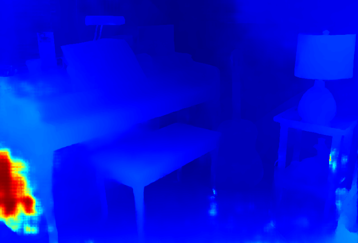

# banet_cpp

## About This Project

该项目是`BANet`算法的c++实现，包括`TensorRT`、`RKNN`、`OnnxRuntime`三种硬件平台(推理引擎)

## Features

1. 支持多种推理引擎: `TensorRT`、`RKNN`、`OnnxRuntime`
2. 支持异步、多核推理，算法吞吐量较高，特别是`RK3588`平台
3. 支持部署后模型的正确性、性能、精度测试。

## Demo

|  |  |
|:----------------------------------------:|:----:|
| **left image**  | **disp in color** |

带有***async***标志的代表使用异步流程进行推理。

|  jetson-orin-nx-16GB   |   qps   |  cpu   |
|:---------:|:---------:|:----------------:|
|  banet(fp16)   |   **18**   |  40%   |
|  banet(fp16) - ***async***  |   **19**   |  49%   |

|  orangepi-5-plus-16GB   |   qps   |  cpu   |
|:---------:|:---------:|:----------------:|
|  banet(fp16)   |   2.1   |  29%   |
|  banet(fp16) - ***async***  |   6.3   |  63%   |

## Usage

### Download Project

下载git项目
```bash
git clone git@github.com:zz990099/banet_cpp.git
cd banet_cpp
git submodule init && git submodule update
```

### Build Enviroment

使用docker构建工作环境
```bash
cd banet_cpp
bash easy_deploy_tool/docker/easy_deploy_startup.sh # 选择对应的平台和环境
bash easy_deploy_tool/docker/into_docker.sh
```

### Compile Codes

***支持stereo-matching算法的evaluation*** 

使用`-DENABLE_DEBUG_OUTPUT=ON`来开启测试log输出

在docker容器内，编译工程. 使用 `-DENABLE_*`宏来启用某种推理框架，可用的有: `-DENABLE_TENSORRT=ON`、`-DENABLE_RKNN=ON`、`-DENABLE_ORT=ON`，可以兼容。 
```bash
cd /workspace
mdkir build && cd build
cmake .. -DENABLE_DEBUG_OUTPUT=OFF \
         -DBUILD_TESTING=ON \
         -DBUILD_EVAL=ON \
         -DBUILD_BENCHMARK=ON \
         -DENABLE_TENSORRT=ON
make -j
```

### Convert Model

在docker容器内，运行模型转换脚本
```bash
cd /workspace
bash tools/cvt_onnx2trt.sh
# 或者运行python脚本，将模型转换为rknn
bash tools/cvt_onnx2rknn.sh
```

### Run Test Cases

运行测试用例，具体测试用例请参考代码。
```bash
cd /workspace/build
# 运行正确性测试
./bin/test_stereo_banet
# 运行性能benchmark
./bin/benchmark_stereo_banet
# 运行精度测试(epe)
./bin/eval_stereo_banet
```

### Prepare Dataset for Evaluation

在[SceneFlow](https://lmb.informatik.uni-freiburg.de/resources/datasets/SceneFlowDatasets.en.html)上下载`flyingthings3d_frames_finalpass`和`flyingthings3d_disparity`，解压后放到`/workspace/test_data/sceneflow/FlyingThings3D`下

## References

- [BANet](https://github.com/gangweix/BANet)
- [EasyDeployTool](https://github.com/zz990099/EasyDeployTool)
